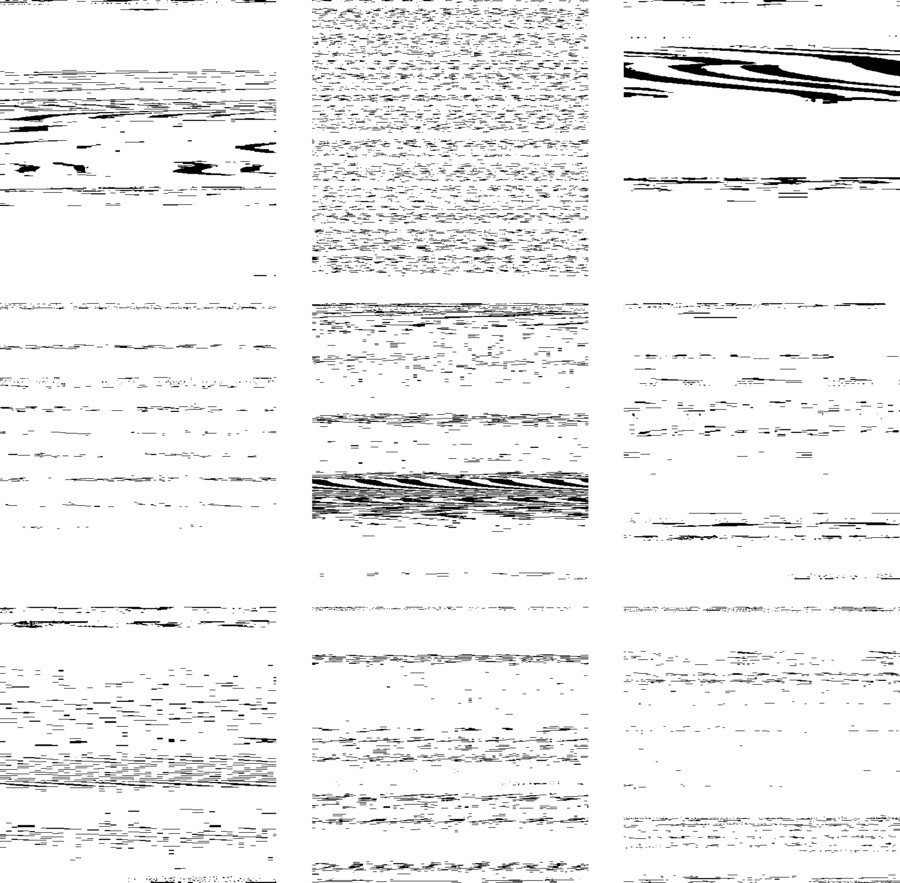

As part of my thesis at the Media Lab, I collected many audio messages. I chose some, transformed each one into RAW file format, and then imported that file to Photoshop. Each square is a different audio recording - you can see the areas where there was more noise appearing darker than the rest.

