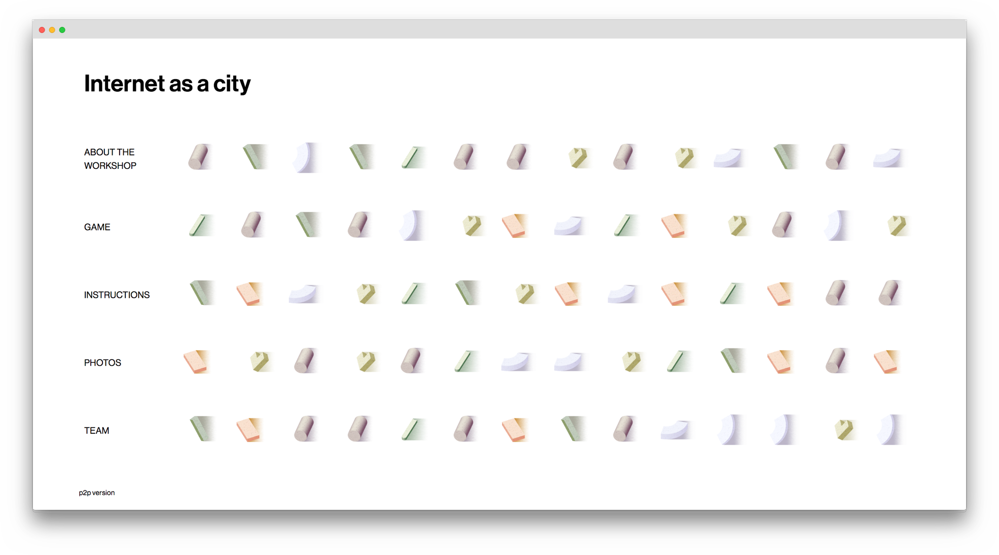

We held a weird, collaborative, speculative, loud and most importantly really fun workshop called "Internet as a city" at the [Decentralized Web Summit](https://decentralizedweb.net/) in SF in the beginning of August. If you are curious to know more, you can access the website [here](https://internetas.city/) or if you are using Beaker [here](dat://internetasacity.hashbase.io/).

