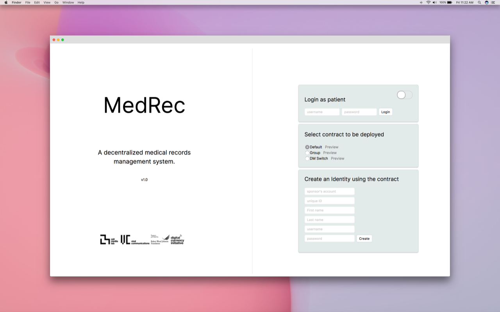

<a href="https://medrec.media.mit.edu/" target="_blank">You can read more at the official website</a> and visit the <a href="https://github.com/mitmedialab/medrec" target="_blank">open source Github repo </a>.

*This project was supported by a grant on behalf of the Robertwood Johnson Foundation.*
