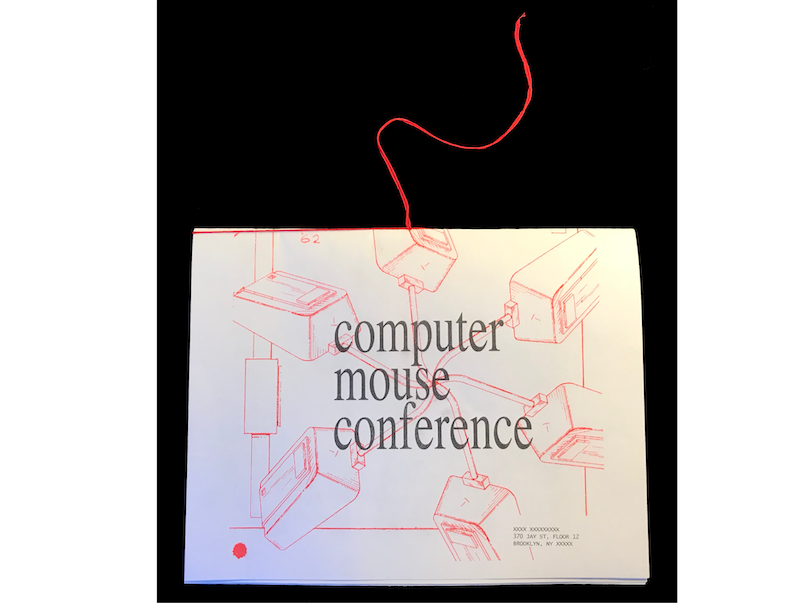
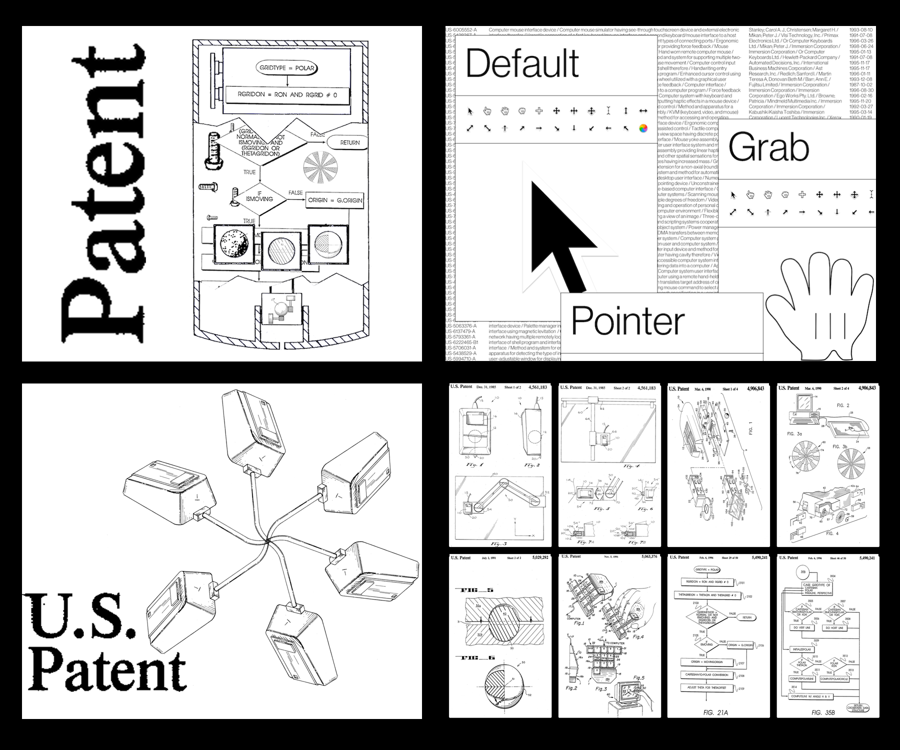

A lot of worldwide patent filings are [https://patents.google.com/](available) to the public domain (by Google, of course). I was always into this very particular aesthetic of mechanical drawings, so I have been digging in there in search for interesting narratives about the history of computation and the Web. I recently created a series of images for the Computer Mouse Conference held at NYU ITP program. 

