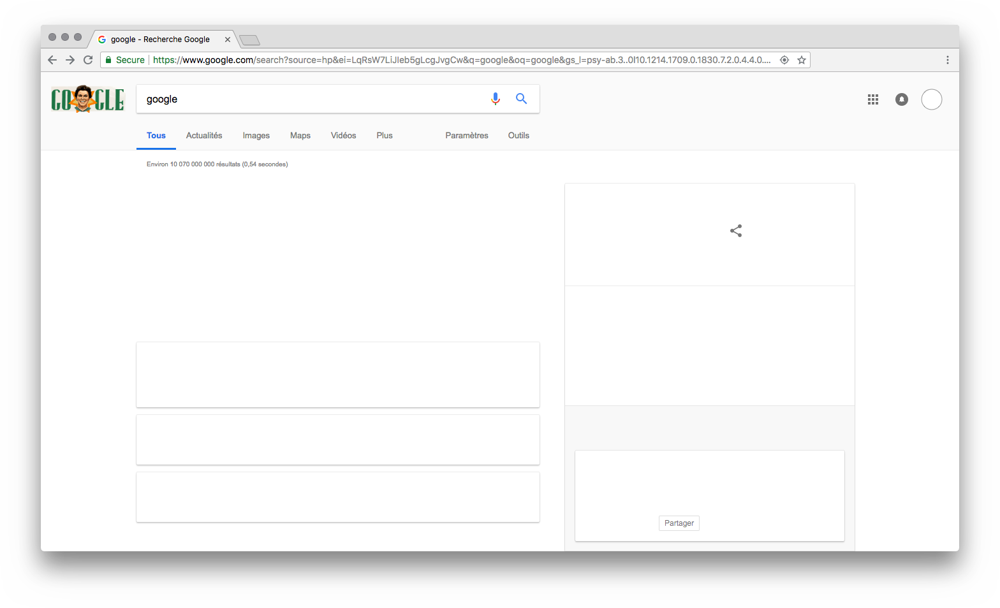
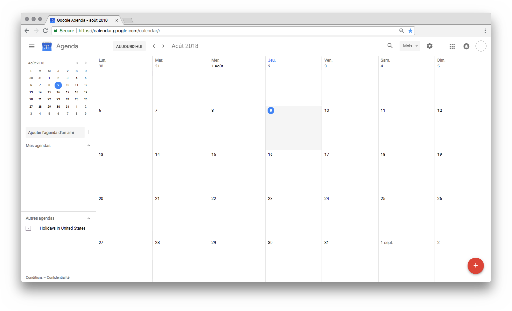
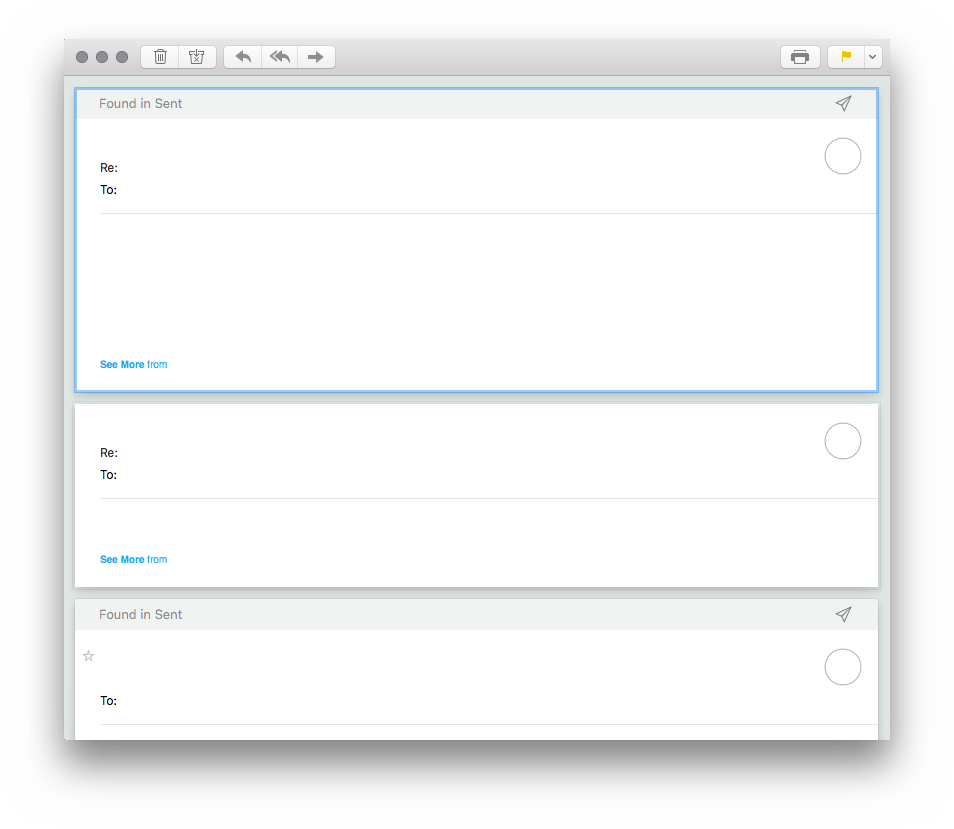
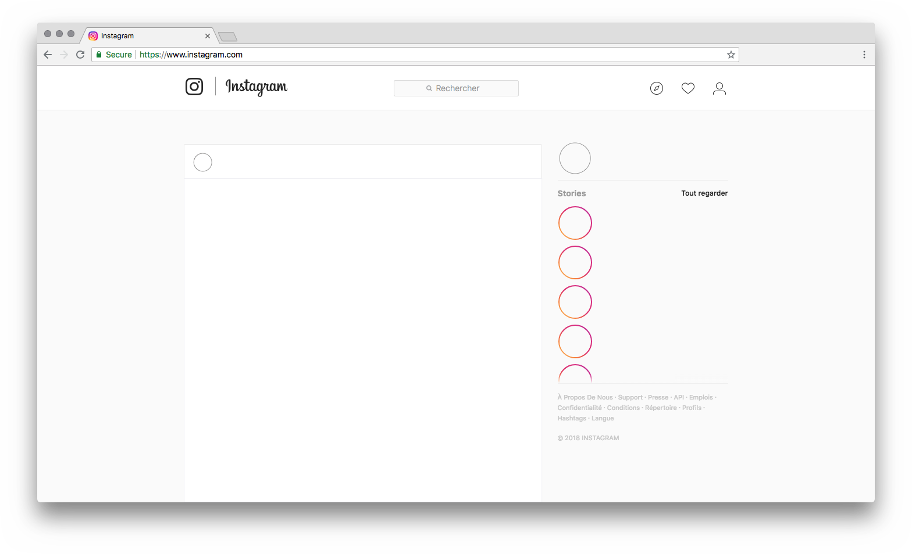
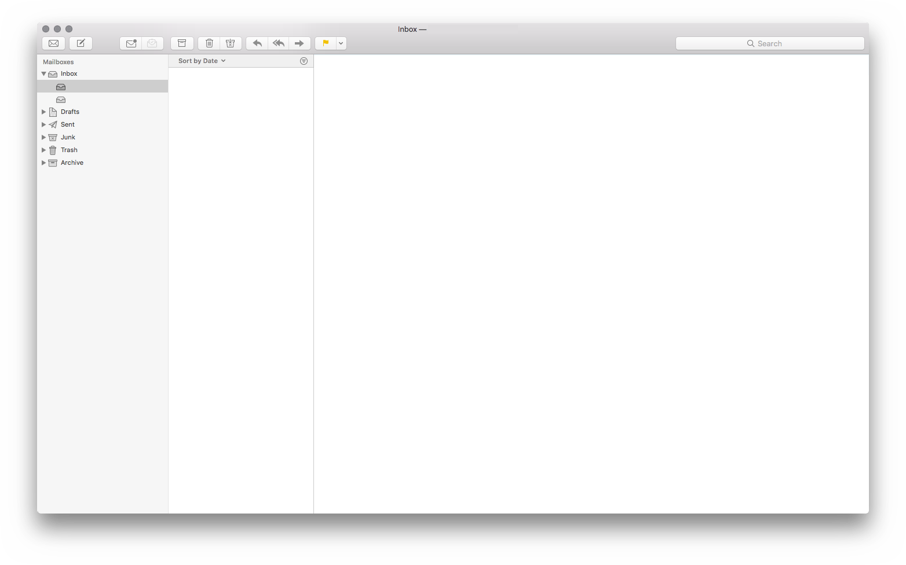
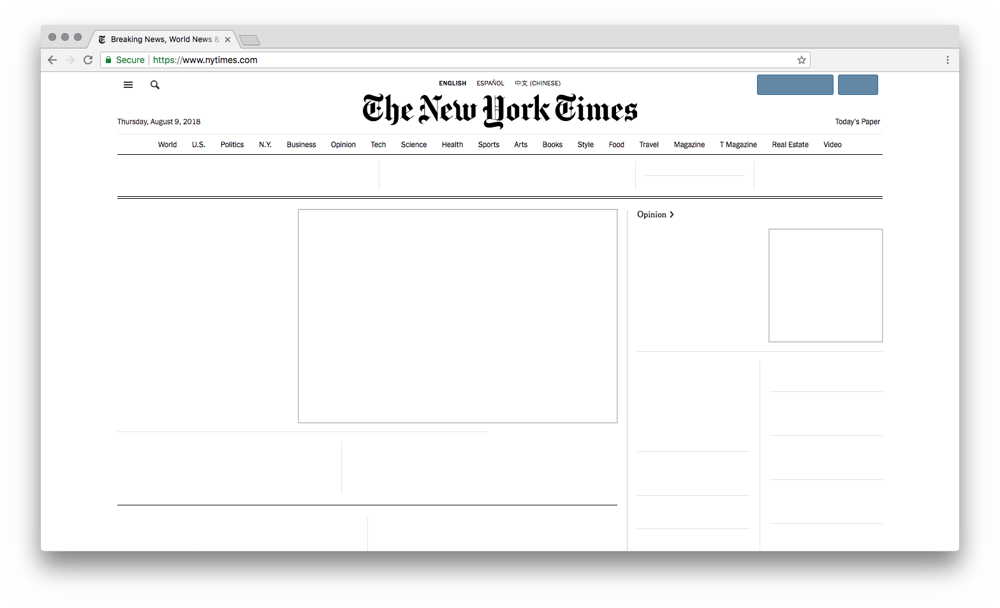
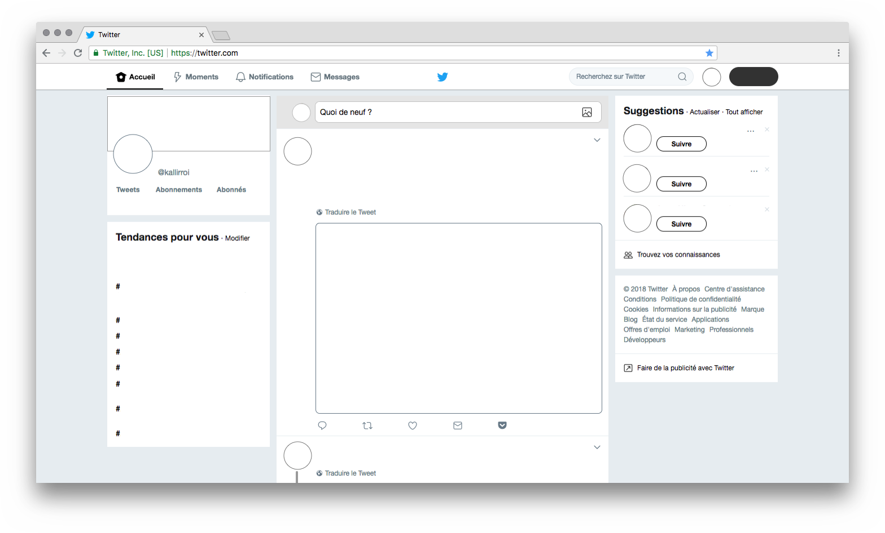

I was curious to create images of my most used online interfaces, stripped of anything that is considered "informational". No usernames, dates, content. Only empty tweets, emails, outlines of images and whatever remains of the UI (barely anything).

It was a fun couple of hours, and felt quite soothing to make all the informational congestion go away. Not sure if this project can go any further, but it's been enjoyable to entertain this curiosity. Also, I realized a year ago I was thinking along similar lines [(link)](https://kalli-retzepi.com/clickhere/).

Copyright Kalli Retzepi 2019
