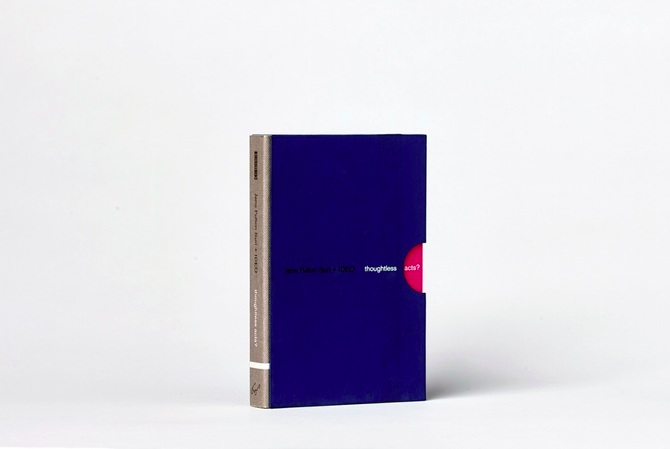

This <a href="https://blog.interactivethings.com/thoughtless-acts-962a824bb0b5" target="_blank">Medium post</a> gives a lot of detail about this project - all I want to say here is that this little book is full of wonders. It is a magical exercise in *seeing* rather than *looking* at the different types of interactions we engage in with our surroundings.

For those of you who are interested in purchasing the book, I have noticed it goes in and out of circulation - one time I saw it on Amazon for more than $500 (I got it on Canadian eBay for much much less but still rather pricey). Worth every cent :)

