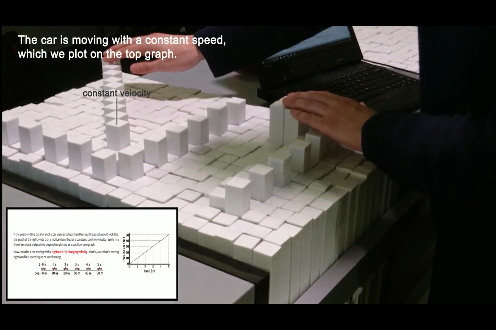
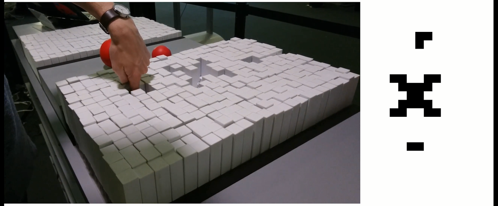
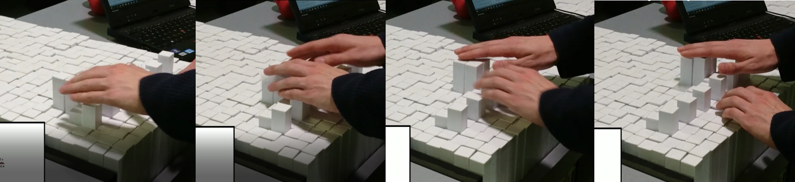
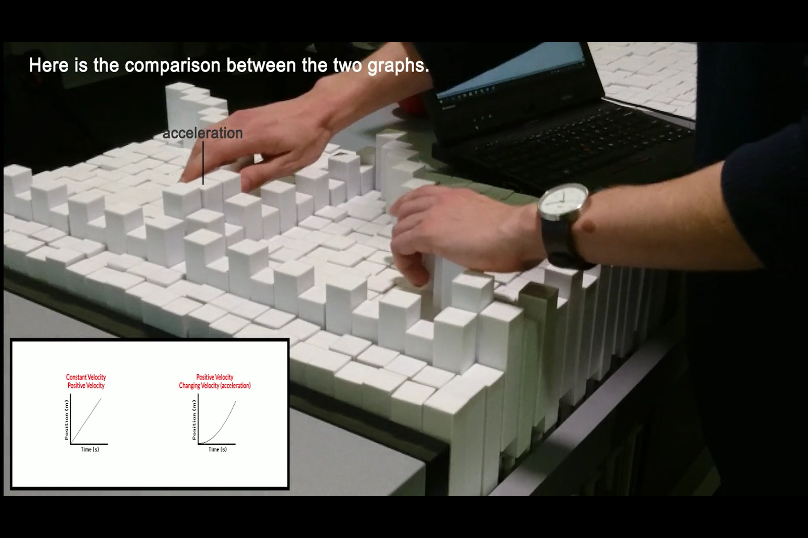
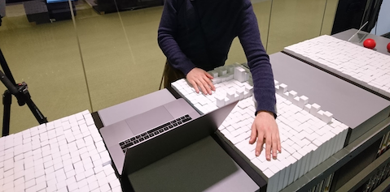
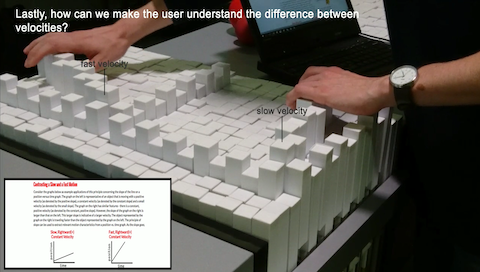

The main premise of our project is the two dimensional physicalization of graphical data representations containted in a web page, which would otherwise be missed or insufficiently described via a screen reader to a visually impaired person. By using “TRANSFORM” we are able to turn two-dimensional digital representations of plots, graphs and sketches into physical representations that visually impaired students can interact with. Such students would typically use a screen reader software to browse through digital content, and once encountering a graph either automatically skip it or hear a simplistic label description such as “graph for velocity and time”. Not being able to easily understand the information communicated with a graph can greatly stunt the student’s progress. We propose to implement a software and hardware system that will accompany the screen reader of a web page, and upon encountering a graph, will suggest a physicalized version of that graph on the nearby TraceForm. It will then animate the given scenario in a tangible dynamic representation.

For our initial prototyping, and before we decided to focus on visually impaired students as our user group, we faced challenges in clearly communicating the use of the platform’s UI. In this initial work we experimented with the use of TRANSFORM as a “physical” calculator that would provide a better understanding of concepts such as division and multiplication. However in most scenarios it wasn’t intuitive how to interact with the transform given its low resolution and the uniform shape and colors of all pins provided no signifiers of how to interact with the device.  Furthermore the affordances of the pins is a matter of pushing rather than pulling since grabbing onto the pins when the surroundings are in same level is difficult. In this configuration it however gets challenging to visually get an overview of the inputs, and pressing individual pins becomes somewhat awkward.

Our conclusion was that in general the use of TRANSFORM as an interface to input and modify data turned out to be cumbersome and in most perspectives inferior to any GUI. We thus shifted our focus to visually impaired users, and the more “passive” application of converting illustrations/diagrams/plots into representations on TRANSFORM. By doing so we avoided the requirement of having an interface upon which the user should be able to construct scenarios. Instead, we could focus on translating graphical spatial representations onto the transform and allowing simple investigative operations to be performed.

One of the platform’s greatest strengths is its ability to dynamically alter its representation in real time and for that reason we chose to focus on the topic of motion (basic physics of linear uniform velocity and acceleration). The programmable pins allowed us to mimic different type of motions; constant and accelerating movements, fast and slow velocities and so forth.

The constraint of having an array of dynamic pins, is that each pin require an individual motor to control, thereby limiting the resolution of the table. As an effect one of our scenarios in which we compare an accelerating velocity and that of a constant, the difference was challenging for our blind user tester to notice at first. Although it’s visually easy to spot, the fact that one can only feel a few test-points simultaneously made it difficult to do the comparison of a vague local trend.  

With the help of our blind test-user we tested out different type of interactions. He provided us with valuable feedback and ideas upon the heights of pins, how the plots were mapped and what should happen when you interacted with the pins by either tapping, holding or doing other actions. Due to the ease of which new scenarios could be changed we were able to adapt and implement and test different type of operations throughout a session of a few hours with his help.

The final concept was made around the scenario of an online ressource on p-t graphs (physics, motion) available here.

As the user listens to the text through a text-to-speech program, the software will prompt whether the user would like the encountered images physicalized on TraceForm. We let our test user interact with the webpage as he would normally browse a new source of information, using his prefered audio-to-text software and then provided the physicilisations of the pre-programmed scenarios as our user progressed through the page.

Through these tests we were able to identify a range of important learnings such as:

- Audio cues: One of the first reactions from our user, was the need to have points speak out their coordinate if pressed briefly. The format should be as compact as possible i.e. “four comma three”. If one wanted more in depth information such as the unit of the axes, the user suggested that one should simply double-tap or hold the pin for a longer period

- Care for use of pin heights: In the prototype each pin represented a value of 0.5 from the original graphical based sketches, and we had chosen to heighten the pins which equalled whole numbers (1,2,3 etc.). The difference in height was very clear, and marked these ticks out as appearing very important. Unless the ticks are of important matter, the user suggested that these were simply leveled with the entire axis or only subtle heightened.

- Difficulty to observe trends in low resolution: By visually inspecting a low-resolution graph it’s possible to see the trend and interpret whether it is in fact supposed to represent a straight or perhaps increasingly steep trend rather easily. This is however not as straightforward if only using a few contact-points at once if inspecting the graph with one’s hands. As a consequence the user at times had a hard time distinguishing the graph representing an accelerating motion and that of a linear velocity. A higher resolution of the medium would resolve this issue.

- Coupling motion and graph works well: According to the user the concept of coupling a straight motion (constant/accelerating velocity) with a 2D plot on a p-t-graph simultaneously provided a good understanding of the concept.

- Interaction with entire limbs: To fully comprehend the scenarios in which the graph dynamically evolved as an effect of a vehicle motion, the user positioned his entire forearm on the TraceForm to be able sense the datatrend as it was emerging. According to the user this technique worked very well but did require some awkward position and might constrain the type of graph displayed to a relatively straight-shape (given the nature of an arm…).

In general the feedback on TraceForm was very positive, and our test user expressed his sincere belief that if he had had such a system when he was learning about physics it would have saved him countless frustrating hours.

<a href="https://www.dropbox.com/s/pgawspwgxi8huta/TraceFORM.pdf?dl=1">link to PDF</a>
