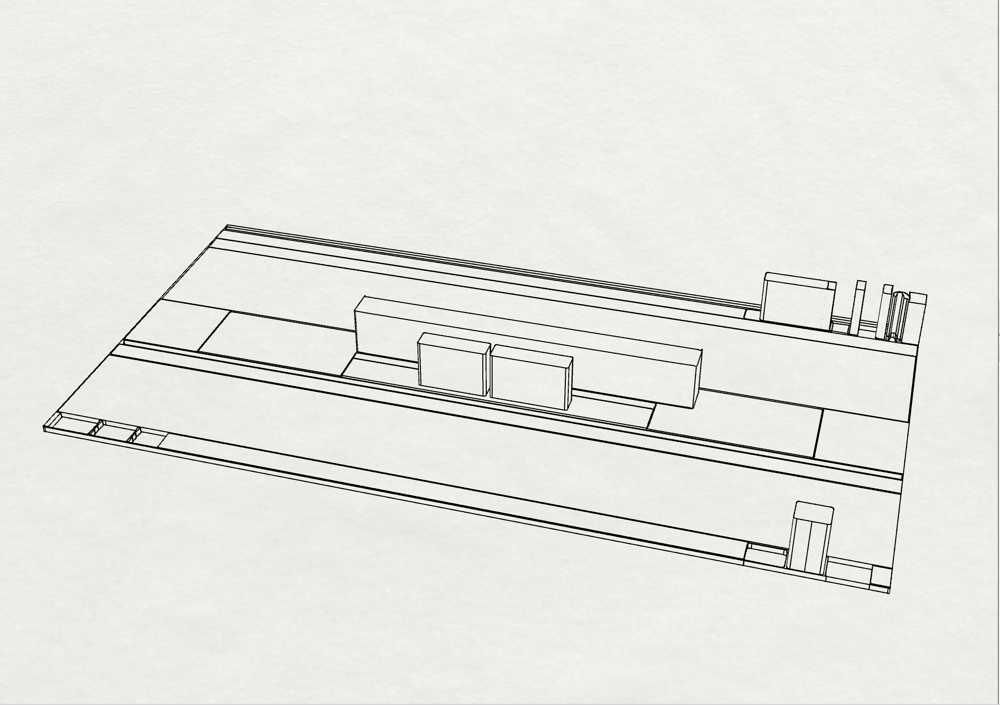
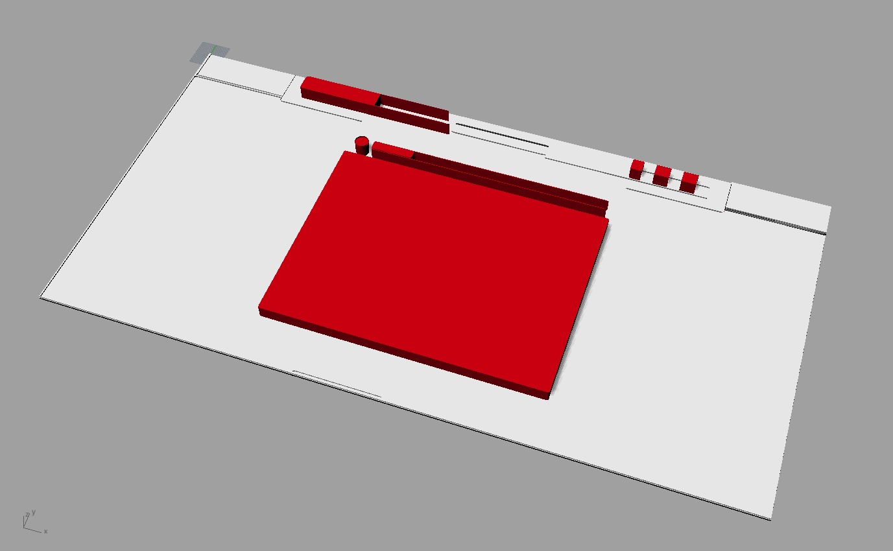

I made a Chrome extension that strips each page down to the most interaction-hungry elements.

&nbsp

&nbsp

&nbsp

&nbsp

&nbsp

Some 3D explorations of the above images:

Google search rendered in 3D:

Instagram rendered in 3D:

