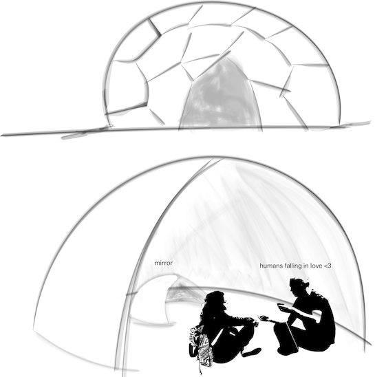
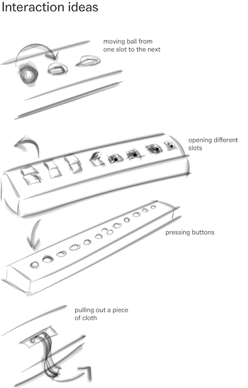
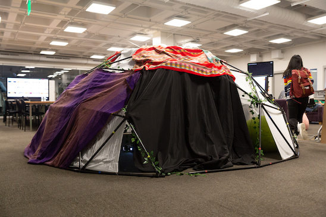
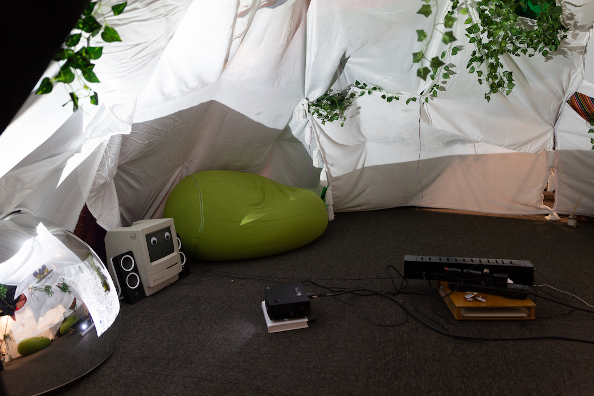

We explored the themes of vulnerability and human connection by creating an immersive, headset-free VR experience using a geodesic dome and a 360 degree projection. Participants entered the space and were presented with a set of questions drawn from the New York Times “The 36 Questions That Lead to Love”. As they proceeded in answering them to each other, their heartbeat was monitored by a subtle wearable device, and its variations reflected on their surrounding projection. The aim of this project was to probe the tension of the virtual versus the real when it comes to human connection - be it with familiar faces or not - and to offer a harbor for that virtuality.

*photo credit: Chenli Ye*
