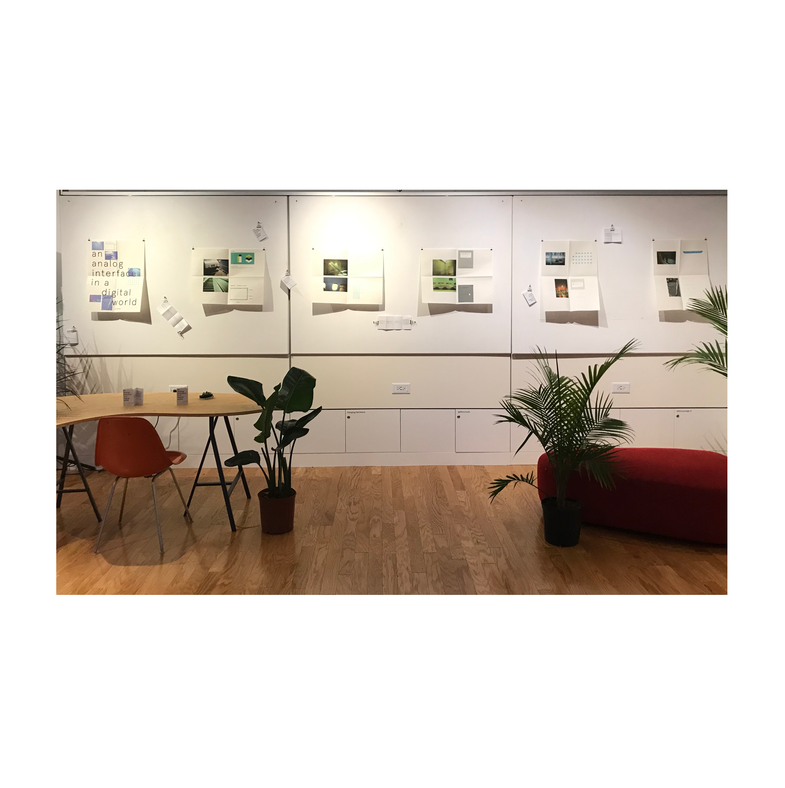

Branden Hookway describes the interface as a “form of relation”. As interfaces increasingly work by inserting themselves in our subconscious ways of being, this short photographic exploration probes the nature of our encounters with them by creating a dialogue between digital and analog interfaces, and asks, given our techno-cultural context, what the consequences of these momentary mediations are.

Wiesner Gallery at MIT

<!--  -->

I created this short photographic essay for a workshop held at the February School at MIT. Initiated in 2018, February School is an annual experiment in peer-to-peer learning which aims to intervene critically reflect on the institutional and pedagogical structures of MIT.
