#### Workshop brief

With the ubiquitous presence of the web, our relationship to the world, even architecture, exists more as images than lived experience; this radical flattening has assumed images equivalent value with the real thing. Limits between the real and artificial, the original and copy have dissolved as files are copied and shared. Simultaneously, deep learning algorithms and other forms of artificial intelligence have challenged traditional notions of authorship and the inherited intelligence of the images we ogle.

This workshop will respond to such a context by mining the image’s performance in translation between digital and physical space across multiple iterations. Issues of materiality, as it blurs between pixels and particulates, meshes and deposition contours, nurbs and textiles, will participate in this radical flattening between the real and the digital. Participants will be asked to transform images (with the option to use machine learning processes), physicalize them in unsuspecting ways, and reformat them as new images.

#### Brainstorming

My initial ideas revolved around using generative deep learning algorithms to produce images and text, that we could in the end pin up and “critique” this artificially generated architectural project. However, this requires an immense quantity of well curated images that was hard to find (I was imagining that we generate multiple sections of a building for example, which would require finding thousands of similar images to train on).

#### Deep Learning

Instead of the above, I decided to play around with some existing algorithms that generate 3D models (1 and 2), and a RNN-Char text generation algorithm. It was not a trivial task, given that the 3D modeling involves transformations between file types I had never worked with (binvox) but eventually I managed to get some results.

I also spent some time setting up an AWS AMI for running the RNN-Char which was very much worth the effort and the money, as it ran in about 1% the time it ran on my Macbook Pro.

Here are some of the models that got generated:

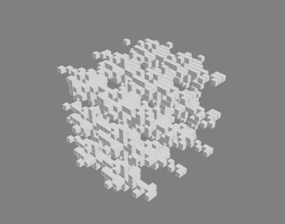
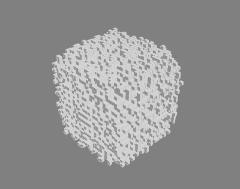
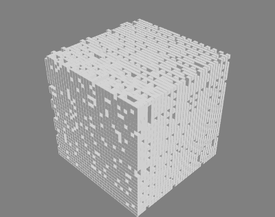

The RNN-Char was trained on a bunch of architectural texts and manuals, and here are some excerpts it generates:

> “the warp detected architectural homes have the region on anticipation, then begins to rise these encloses and a window, and schools, in the previous attrage, which has had large control connections (including all working existing persons): i that how put to erection - a moment, and mechanical dunsto located its exhibition are: aluminium elevation. the smallest decisition of ornament as there are”

> “the bending moment design naturalization, a discussion of the zoning beponescent shown in fig. 5.39/ty considering the idealist service. furthermore, an organic type of shelf: enlarges has the standard moisture content will be fastening the deflection. if the larger degree of proper insupat buttress ratio resulting from a religionated way caused by power area, are listed in serves in permitting”

#### Image processing (Python)

These results were interesting but not as interesting as I thought they would be. I found it hard to evolve them further...so I decided to work with a different set of images (broadcasted news screenshots, like the image below) and stick to the “news consumption” theme.

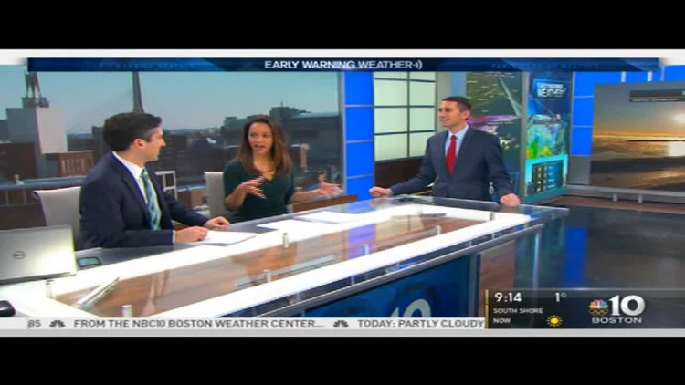

I used Python’s PIL library and this repo to perform some glitching and other image manipulation effects. I had previously modified this script to monitor the wifi network’s jitter so I used the output numbers as an input to the glitch/distortion parameters.

I then mashed up news images in different ways:

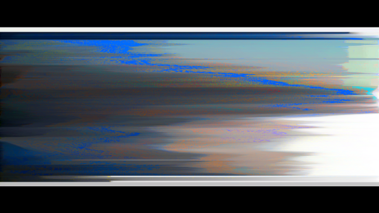
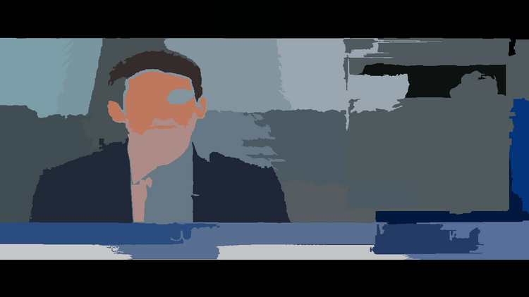
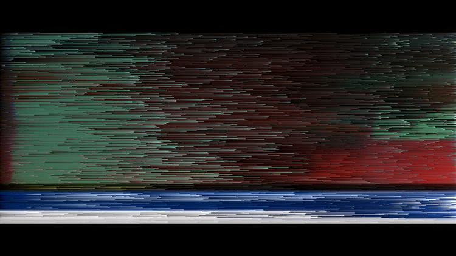
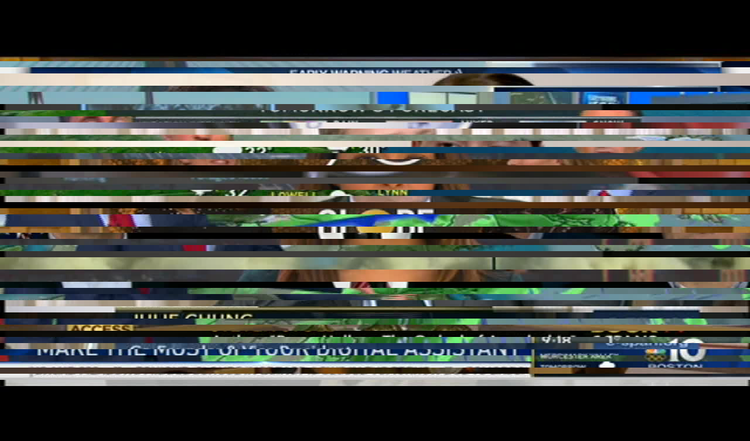

#### 3D modeling (Rhino)

This was practically my first time using Rhino with a defined scope. I wanted to use the above images in conjuction with everyday objects that are loosely related to the theme of “consumption”. I looked up https://3dwarehouse.sketchup.com/ for ideas, and settled with the following objects/scenes:

A grocery store aisle with cereal

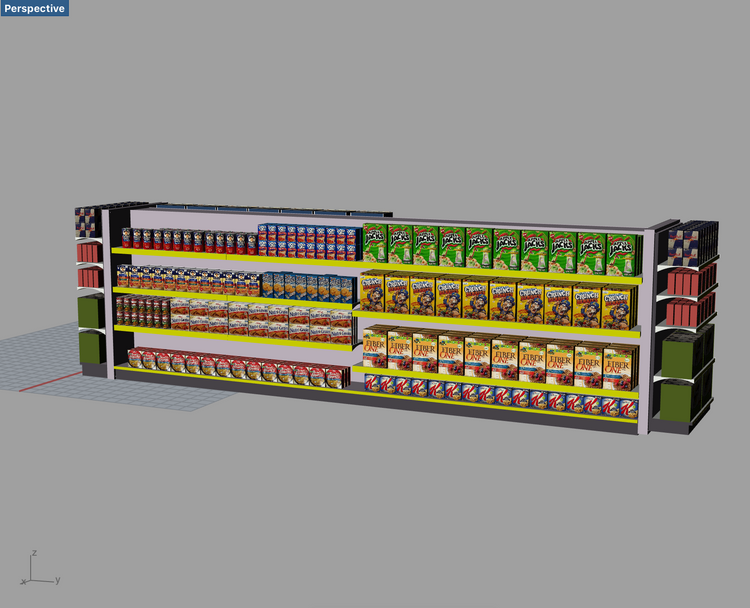

A coffee cup

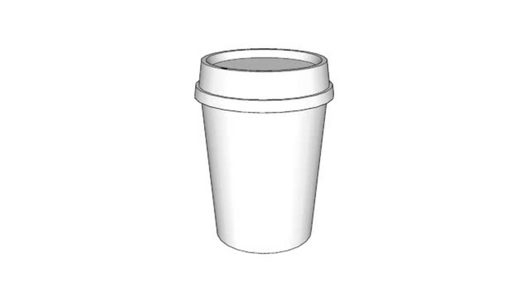

#### Final images (Rhino + Photoshop)

“Cereal news for everyone”

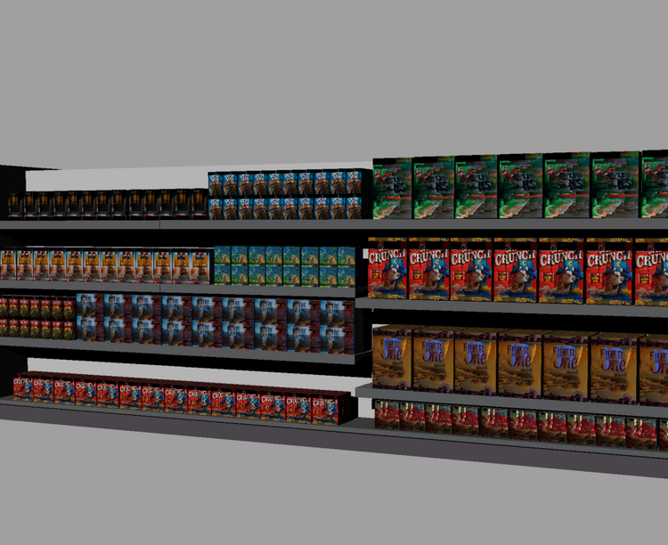

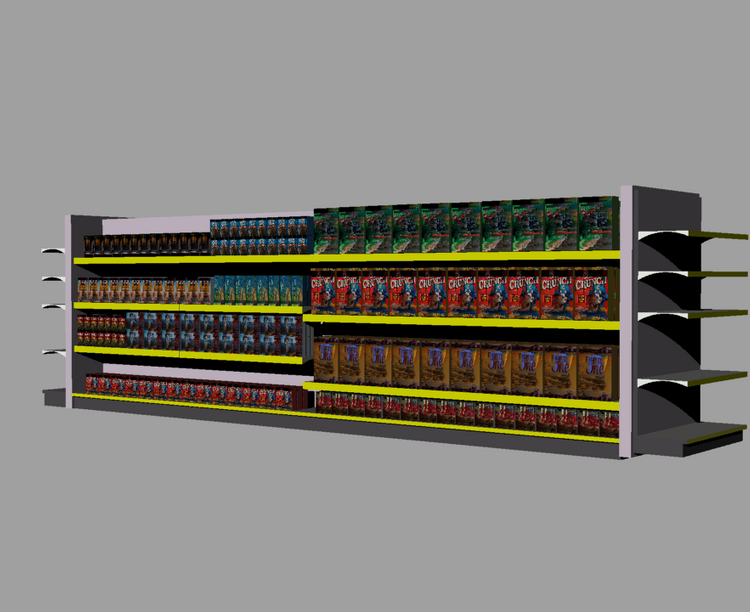

“Stimulating news to go”

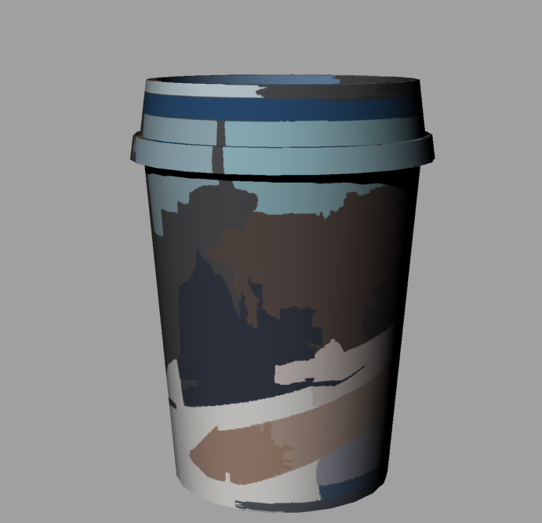
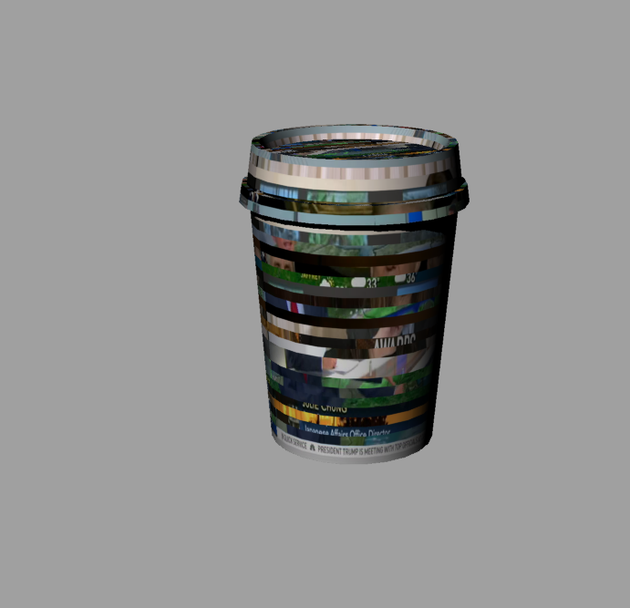
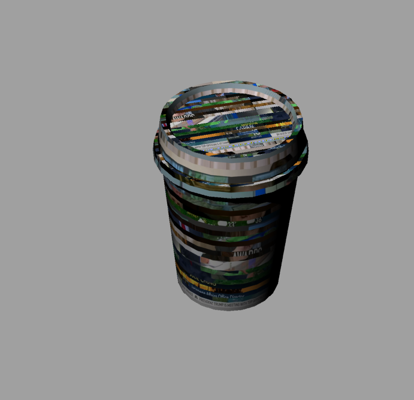

“Ubiquitous news”

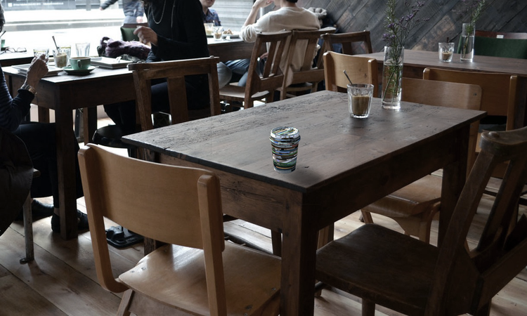

This was a lot of fun, as well as focused work. Thank you to Sam Ghantous for leading this workshop and helping me out with Rhino and overall ideation.

#### Rhino resources

http://cmu-dfab.org/rhino-surf/  
https://www.kadenze.com/courses/computing-form-and-shape-python-programming-with-the-rhinoscript-library  
https://www.youtube.com/watch?v=fMdCZFJ-i38&t=618s  
http://developer.rhino3d.com/guides/rhinopython/  
