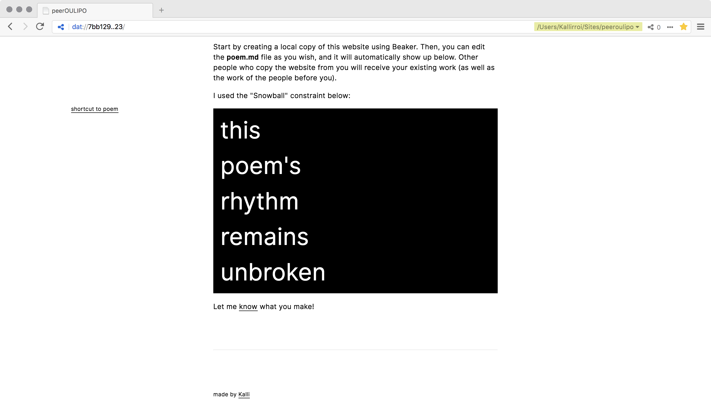

What is a "peer" in the context of the "peer to peer" (p2p) web? Is it a machine or rather a human, behind the machine?

This project is a collaborative, p2p implementation of the OULIPO group (OUvroir de LIttérature POtentielle) active in the 60s which created works using writing constraint techniques. I have created a website using Beaker Browser that serves as a template for a poem, embedded in the website. Anyone can copy the website, and with that, the poem. They can then decide to build on the existing verses, or start anew, leading to a p2p hybrid of OULIPO and telephone game. Ideally, and if there is wider engagement with the project, I would like the poems to exist in a physical form, for example as a simple zine or as postcards that can be mailed around, alluding to the "peer-to-peer" character of their origin.

You can access the website [here](dat://7bb129e7889594e5ec349feffa0e3156a0b77e923d6bf20550842af230ce5923/).

