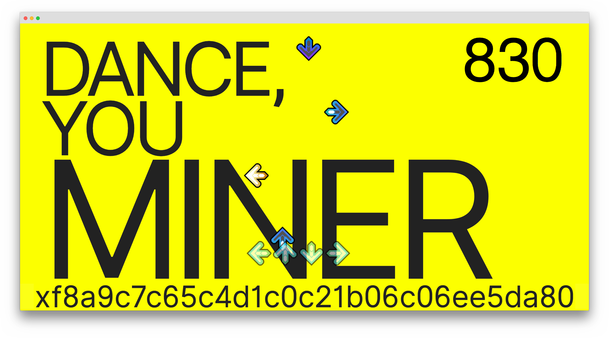
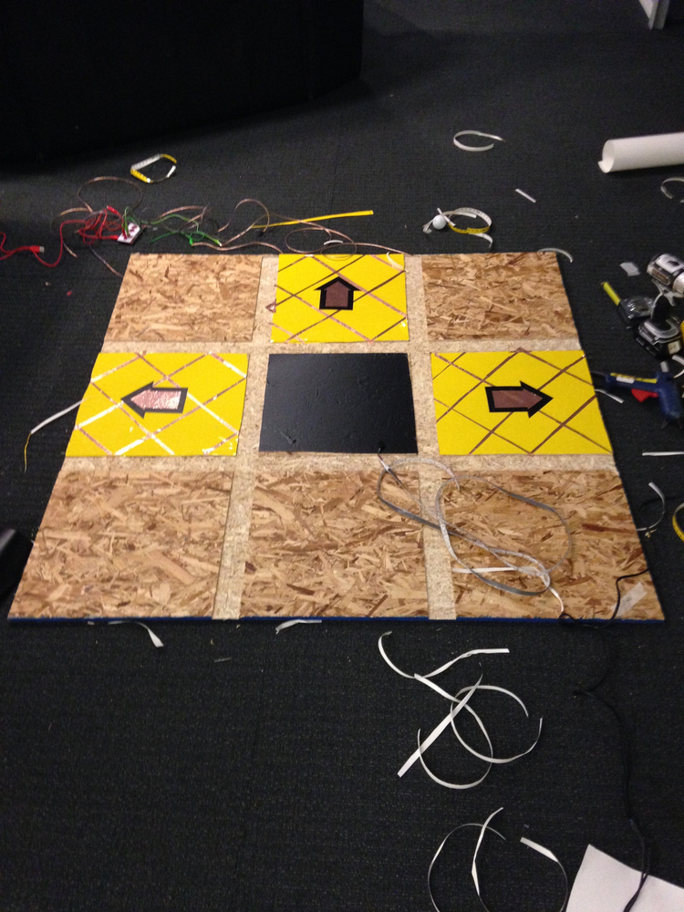
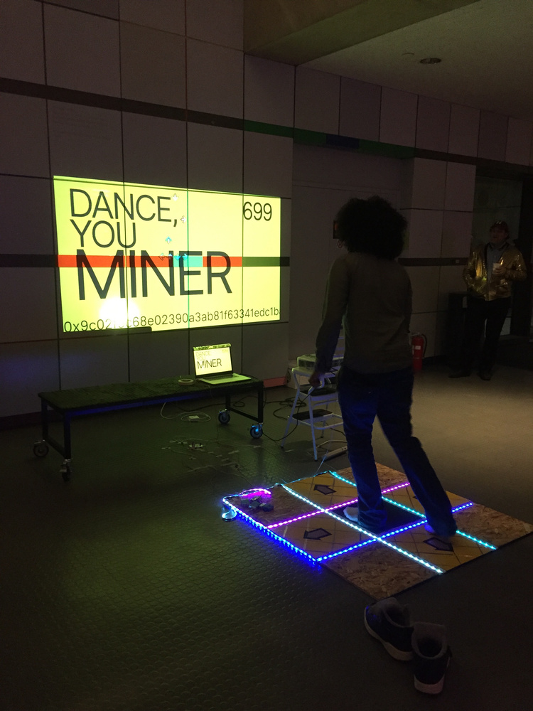
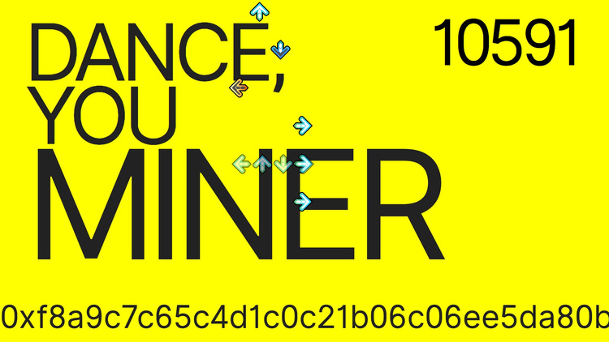

For a party at the Lab, we made a blockchain-based Dance Dance Revolution game that mines (fake) Ether. You can see me dancemining here:

> <blockquote class="twitter-tweet">
&quot;The most feasible way of implementing this would be in a peer-to-peer network of dance mats, so as the number of people dancing goes up, so does the market capitalization of the currency.&quot; <a href="https://t.co/ZOC3zxoj7v">pic.twitter.com/ZOC3zxoj7v</a>
&mdash; MIT Media Lab (@medialab) <a href="https://twitter.com/medialab/status/995030432163991552?ref_src=twsrc%5Etfw">May 11, 2018</a></blockquote>

and you can read more on the story by Sky News <a href="https://news.sky.com/story/in-the-future-youll-mine-cryptocurrency-by-dancing-11374514" target="_blank">here</a>.

Making the dance mat:

Start of the night: 699 blocks mined.

End of the night: more than 10K blocks mined, and the interface kinda broke.💥💥💥

