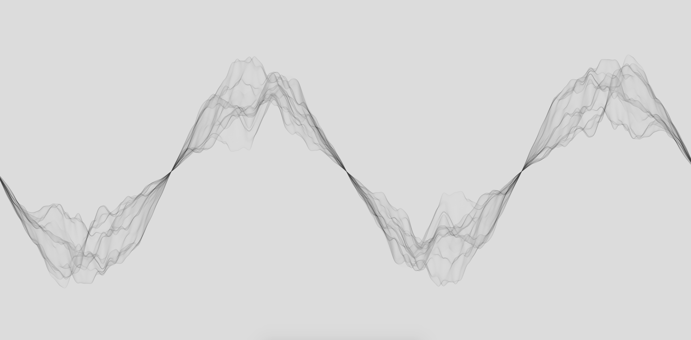
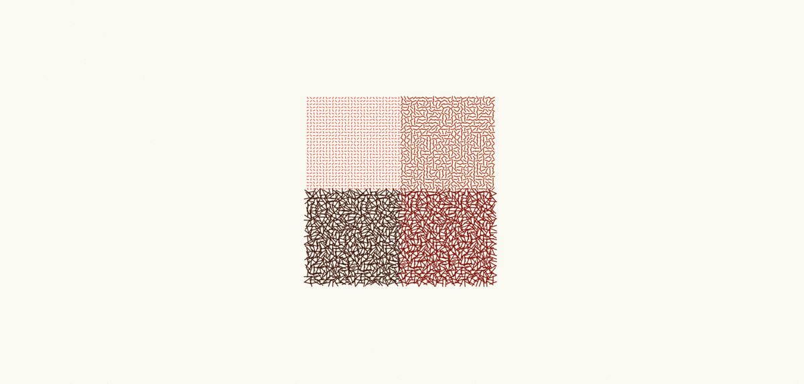
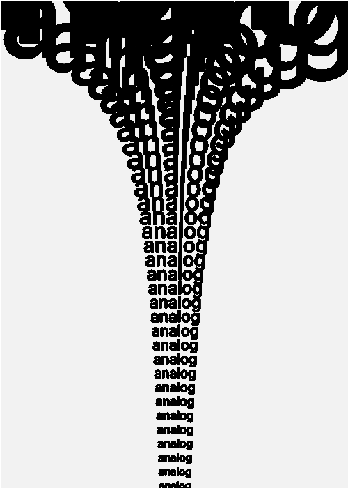

This spring Zach Lieberman taught a three-week long workshop that introduced us to the works of selected visual artists of the past century, and asked us to use recreate their work. It was a very refreshing change to the usual ML class, and opened my mind to different ways of thinking about media and tools.

Inspired by John Whitney:

Inspired by Vera Molnar:

Inspired by Jason Salavon:

Recreating John Maeda:

During the last week I designed a zine for a selection of the artists we visited, which we printed and gave out during May's All-Lab lunch: 

