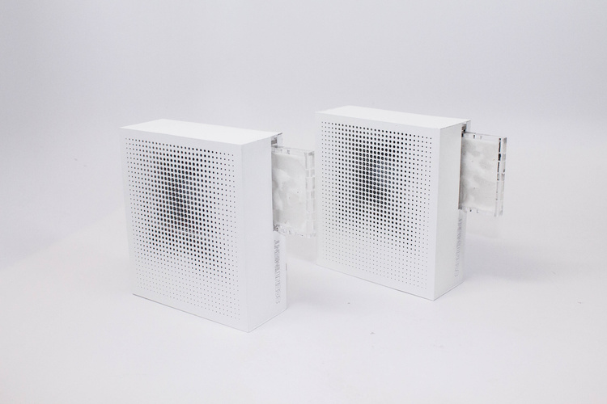
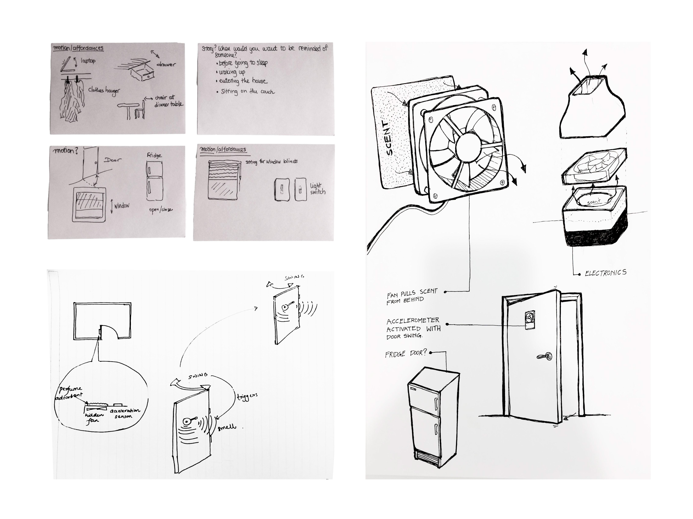
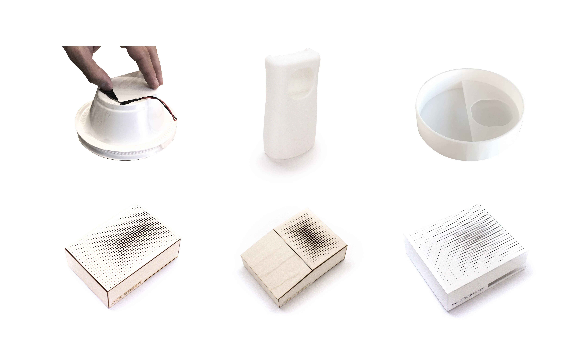
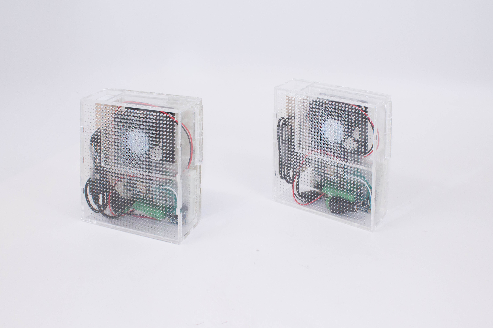

This project explores the concepts of I/O coincidence and Synchronized Distributed Physical Objects presented by the <a href="https://tangible.media.mit.edu/" target="_blank">Tangible Media Group</a> in the past.

We came up with Scentiment, a product aimed to unite distant loved ones through the power of smell.  With this device, telepresence is manifested in the form of fragrance to create an environment of cohabitation.  When a person enters the room, a personalized aroma is emitted in the space of their loved one. 

