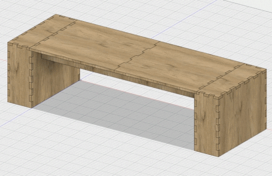

We really believe in the power of storytelling, and in community, so we designed and built a bench, with the hopes of deploying it in a public space like a library. Our bench senses when two people are seated on it, and starts playing excerpts from StoryCorps stories about politics across the political and geographical spectrum of America.

You can read more in the <a href="https://thebenches.media.mit.edu/" target="_blank">official project website</a>.

