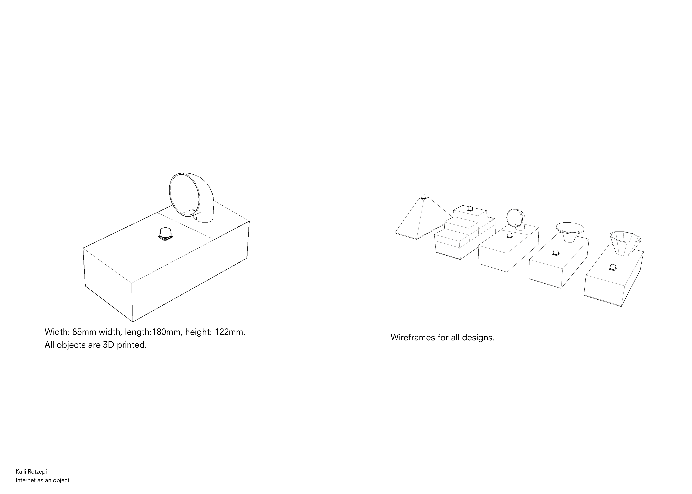
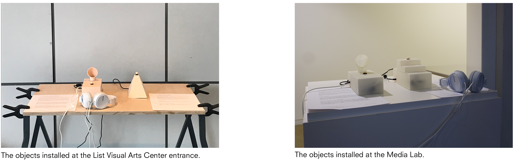
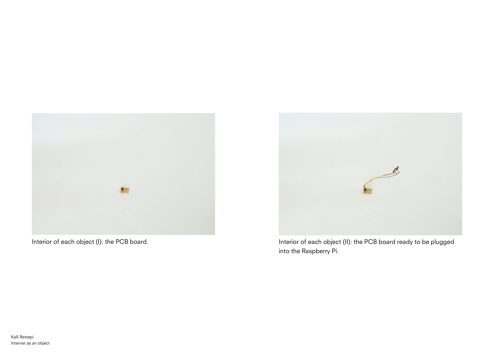
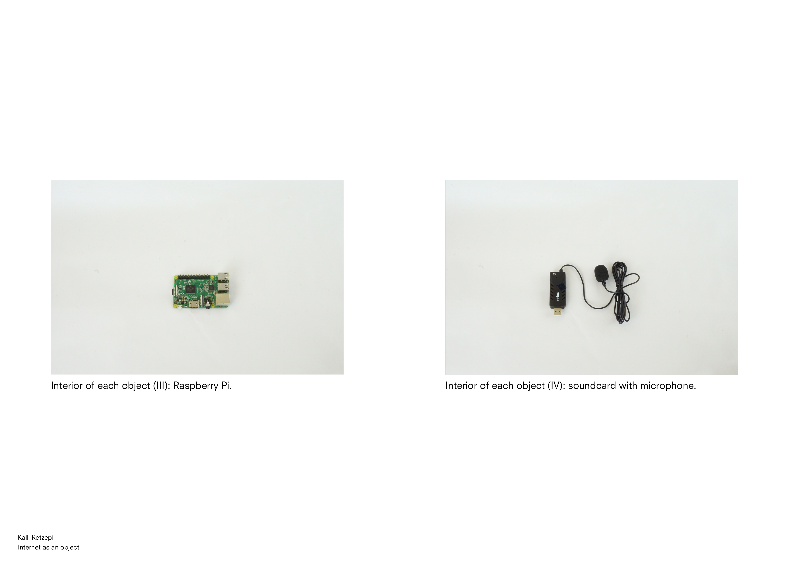

#### Abstract
This thesis lies in the intersection of three avenues: physical non-screen interfaces, storytelling promoting community connectedness and hyper-locality afforded by decentralization. The central question addressed is whether the design and underlying technology of entry points to a network change the way people interact with it and the experience they have. To explore this, I designed and engineered a set of playful physical objects which function as nodes of a hyper-local network. Information bestowed upon this network remains within these nodes, cryptographically secure, and accessible only to local community members who are aware of the network’s existence and mode of operation. I successfully deployed this network in four locations across the MIT campus, where members of the MIT community could record and listen to audio messages using the physical objects. Given the choice, people engaged with the decentralized, closed network more than they did with the control (open) one. The messages collected by the former had a more positive sentiment score and their language was more personal than the control. This work is indicative, but not definitive, evidence that the suggested decentralized and closed network fostered a more positive and expressive discourse than its control counterpart.

I kept a weekly journal of my progress, which you can find <a href="https://there.am/pwr01-internet-as-an-object/" target="_blank"> here</a>.

