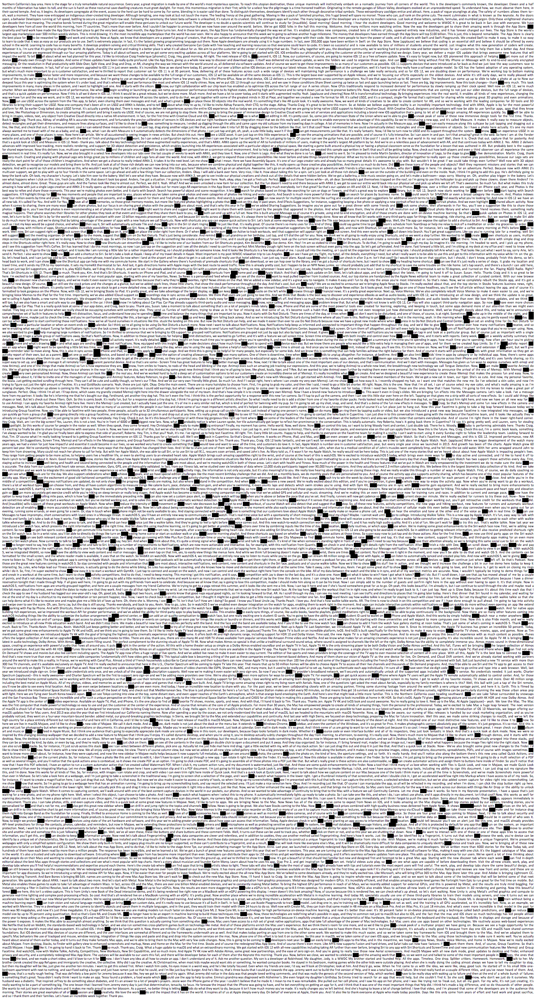

How many times does the word "you", or variations of it, get mentioned in the big tech keynote presentations?
A lot.

Apple Keynote 2018 - <a href="https://youtheusers.netlify.com/" target="_blank">link</a>

Google 2018 Keynote

Copyright Kalli Retzepi 2018
